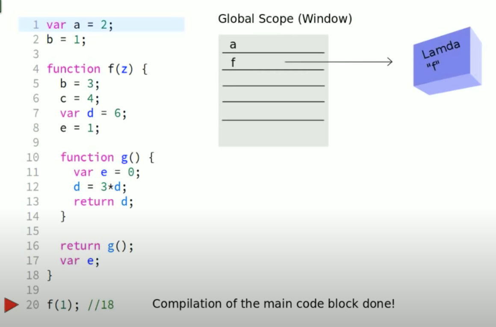
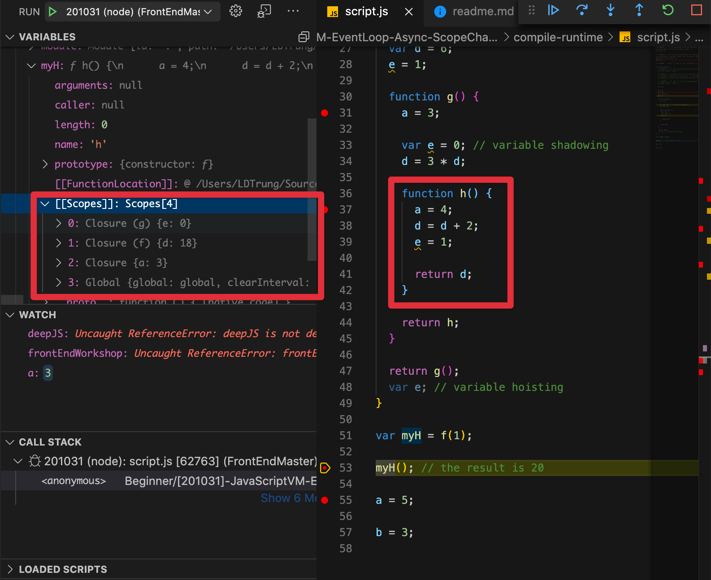
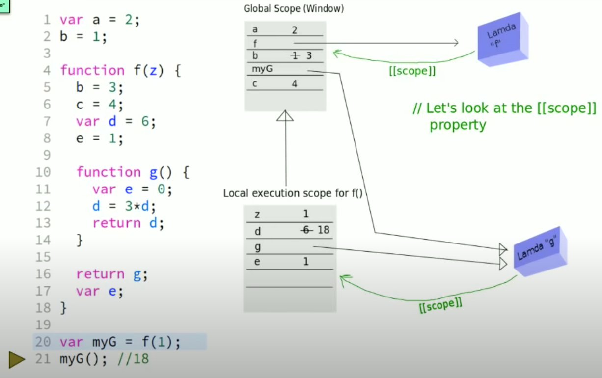

# Compile & RunTime

[Arindam Paul - JavaScript VM internals, EventLoop, Async and ScopeChains](https://www.youtube.com/watch?v=QyUFheng6J0&feature=emb_logo)

## Basic

JavaScript is not actually a compile language. JavaScript code is **interpreted** at runtime, but will be **compiled** if needed (for optimization,...).

When JavaScript engine (e.g. V8 in Chrome or V8 in NodeJS) execute code in specific scope, the compiler will **skim through that scope** and **allocate memory for every variables & functions declaration** with default value (e.g. `undefined` for variables).



## Difference between Nodejs and Chrome RunTime

In `browser`, variables/functions are declared and assigned to the `global` scope by default.

In `Node`, variables/functions are declared and assigned to the `module` scope (the file) by default, unless you explicitly assign them to `module.exports`.

```javascript
var a = 1;
// CHROME :: a is allocated in global scope
// NODEJS :: a is allocated in module scope
```

This is not a declaration statement

```javascript
b = 1;
// CHROME :: b is allocated in global scope
// NODEJS :: b is allocated in global scope
```

The engine will execute this line at runtime, and realize that _b_ is not existed, then the engine will allocate _b_ automatically.

In fact, when you run `node myfile.js` or `require('somefile.js')` the code in your file is wrapped as follow:

```javascript
(function (exports, require, module, **filename, **dirname) {
    // your code is here
});
```

You can think the `module` scope is just a `function` scope that `NodeJS` create at starting point.

## Access variables & functions at RunTime

According to [Basic section](##Basic), when JavaScript engine run code in specific scope, it found a function declaration, it will do the following to generate a function definition (also called `lamda`):

- store code as text
- evaluate `scope chain` that binding to this function and **reference** to it by `hidden property` named `[[scope]]`
  - if variable(s) of outer scope(s) is required by this function, the `closure`(s) of outer scope(s) will be created and reference to required variable(s). `Closure` keeps variables alive even if outer function finished.
  - Global scope and `Closure`(s) are added into scope chain.
- then it allocate function's definition in heap.

When function is executing, the scope chain and their variable(s) that referenced by `[[scope]]` are still alive (preventing garbage collection). Providing 3 spaces to resolve variable(s):

- global scope
- local scope (scope of current execute function)
- closure(s)





## Closure

This is what makes a asynchronous programming even possible for JavaScript.
